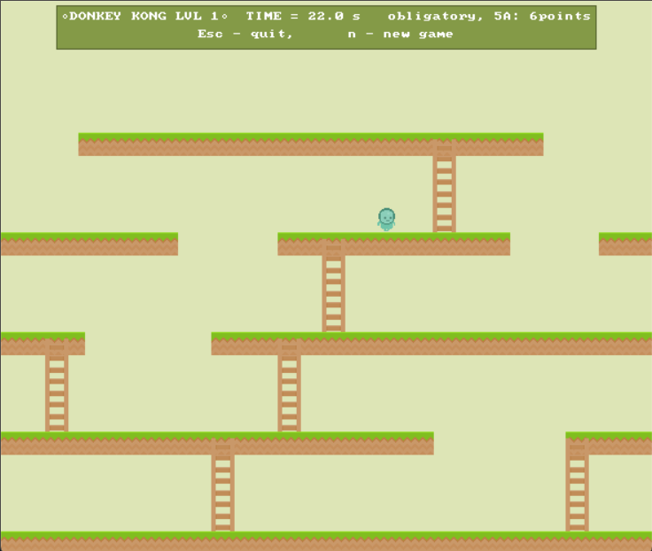

# Donkey Kong - inspired game
This project is a Donkey Kong - inspired game developed as a project for passing my university programming classes.

# Project overview
The game is written in C++ and features a custom user interface that allows players to control their character, avoid obstacles, and climb towards the goal—staying true to the classic arcade gameplay.
Users can start a new game, quit current one, move within the game window and have a great time :)

# Technologies used
- C++ (core game logic)
- Object-Oriented Programming (OOP) principles
- User Interface built for interaction and game rendering

# Features
- Classic Donkey Kong mechanics: ladders, barrels, and jumping
- Implements basic physics ex. gravity and collision handling
- Responsive controls for smooth gameplay
- Score tracking system
- Structured, modular C++ code following best practices
